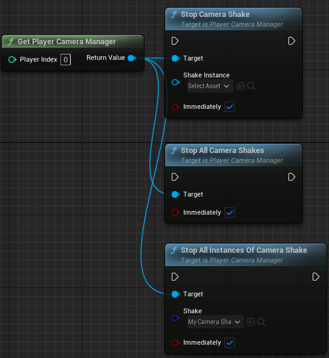
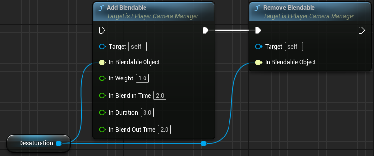
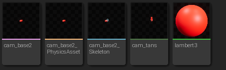
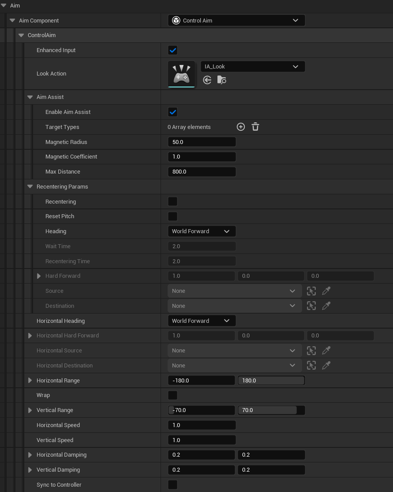
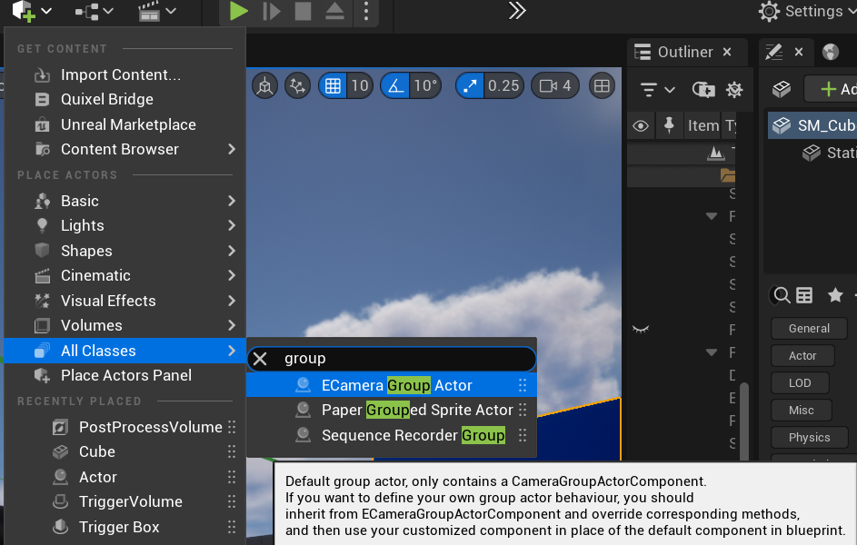
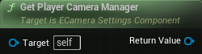
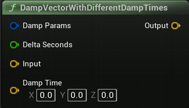
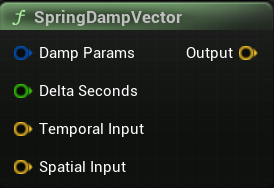

# Introduction
***EasyCamera*** is a simplified, extensible and designer-friendly camera system for Unreal Engine. It enhances the built-in spring arm and camera components in native Unreal editor across a wide variety of common gameplay camera behaviours such as keeping a target at a fixed screen position, moving on rail, and resolving occulusion in complex occasions, enabling you to easily create plentiful smooth camera movements and effects within only few minutes.

Before going forward, you can visit [Showcases](#showcases) to take a look at the example camera behaviours you can create with EasyCamera. Then you should go through the [Basic Uses](#basic-uses) section to learn the basic uses of EasyCamera. If you want to customize EasyCamera through blueprints, or if you want to use EasyCamera in GAS (Gameplay Ability System), please read the [Advanced Uses](#advanced-uses) section. A complete list of blueprint nodes can be found at [Blueprint Nodes List](#blueprint-nodes-list).

**Supported Engine Versions**: 5.1

**Supported Platforms**: Windows

**Major Features**

- A full toolset of camera components allowing for composition to create different camera behaviours.
- Clear concept separation of follow component, aim component and extension component, providing easy control over camera position, camera rotation and camera post-process respectively.
- Tons of helper functions for you to easily manipulate cameras.
- Easy combination with animation, montage and GAS.
- Highly customizable blueprint nodes to define your own camera components.

**Detailed Features**

- Follow component *FramingFollow* tries to keep the following target at a fixed screen position, with damping and offset.
- Follow component *SimpleFollow* tried to keep a fixed relationship between camera position and following target position, either in world space or target's local space.
- Follow component *HardLockFollow* uses exactly the following target's position, with offset applied in local space.
- Follow component *OrbitFollow* follows the target on the surface formed by several orbits that you can add or remove at will.
- Follow component *RailFollow* enables camera to move on a pre-defined rail.
- Follow component *CraneFollow* enables camera to move on a pre-defined crane.
- Aim component *TargetingAim* oriented camera to the aim target, with damping and offset.
- Aim component *HardLockAim* imposes aim target's rotation to camera, with angular offset.
- Aim component *ControlAim* receives player input to control camera rotation.
- Extension component *DeoccluderExtension* displaces camera to avoid any occlusion along the camera view sight.
- Extension component *ConfinerExtension* restricts camera within given boxes.
- Extension component *ResolveGroupActorExtension* adjusts camera field of view and distance to encompass group actors, if any in follow component and aim component.
- Extension component *AnimatedCameraExtension* enables animating cameras through imported animations.
- The *ECameraHUD* class visualizes camera debug infomation to help you set appropriate parameters.
- The *ECameraGroupActor* actor supports adding multiple actors in the level as well as their weights, then calculating a group-level position and rotation.

**Installation**

- (Unfinished) *Marketplace*. You can install EasyCamera from Unreal Engine marketplace. Select the `Marketplace` tab in Epic launcher, search `EasyCamera` and follow the installation instructions. This will automatically install EasyCamera to your Unreal Engine and works for all projects opened with the correct version Unreal editor.
- *Github*: download source code from this github project (click the green button `Code` on the top right side and select `Download Zip`), and unzip it to your Unreal project's `Plugins` folder, e.g., `D:\UnrealProjects\MyProject\Plugins\`. If your project does not have a `Plugins` folder, just create one. You can safely delete the `README.md` file and the `Docs` directory if you do not need documentation on your local PC. The final path should be like this `D:\UnrealProjects\MyProject\Plugins\EasyCamera`.

# Basic Uses
This section demonstrates some basic uses of EasyCamera, including the general workflow, creating camera behaviours you'd expect, calling them from blueprint, visualizing debug information, etc. It only takes you few minutes to master the basic uses of EasyCamera and then you can create various nice camera behaviours painlessly by combining different **camera components** and setting the parameters in these components. 

## General Workflow
To put it simply, you only need to take three steps: preparations, combining camera components and calling the camera in blueprint.

### Preparations
Before using EasyCamera, you must do some preparation work first.

1. Add an `ECameraManager` actor into the level. On to top tool bar, click "Add"->"All Classes"->"ECamera Manager". Drag it into the level regardless of its position. Now it is not mandatory to do this. When you run your project, this actor will be automatically added into the level if you do not add it in advance.

1. (Optional) EaseCamera facilitates the use of post processing between different cameras, and if you want to use, you must set up a `EPlayerCameraManager` class in the `Player Controller Class` parameter of `World Settings`. Specifically, open the `World Settings` windows, locates to `Game Mode`, open the `Player Controller Class` blueprint, and change the value of `Player Camera Manager Class` to `EPlayerCameraManager`. Note that if you are using a C++ project instead of a blueprint project, you probably need to create a new player controller class inherited from the raw `PlayerController` class and assign it to game mode.  

1. (Optional) If you want to enable debug visualization at runtime, you must set up a `ECameraHUD` class in the `HUD Class` parameter of `World Settings`.  

If you are working on a large commercial project, I strongly recommend you copy and modify the source code of `EPlayerCameraManager` and `ECameraHUD` to meet your needs. 

### Using Different Camera Components to Create Camera Behaviours
Once you have finished the above preparation work, you can set out to create your cameras by following the next steps.

1. Create a new camera class. In the content browser, right click and select "Blueprint Class", then search for "ECameraBase" and click "Select".  

2. Open the blueprint class you just created, you will see on the top left `Components` tab a `CameraComponent` and a `CameraSettingsComponent`.  
  
Click the `CameraSettingsComponent` and in the `Details` panel you will see the parameters under the `ECamera` group, i.e., `Follow Component`, `Aim Component` and `Extensions`.  
  
Each parameter requires you to fill in a camera component, which defines how this camera actor moves and rotates. You can play with these built-in components and change their inner parameters to see how they control the camera. A complete explanation of all components can be found at [Camera Components](#camera-components). Or you can customize your own camera components, for which you can refer to [Customizing Camera Components](#customizing-camera-components).

### Calling the Camera in Blueprint
Once you complete your camera, you can call it in blueprint whenever you want. The blueprint node you are using to call the camera is `CallCamera`. It can receive many parameters, and the most important ones are `Camera Class`, `Follow Target`, `Aim Target` and `Blend Time`. A complete explanation of the `CallCamera` node is given in the [Blueprint Nodes List](#blueprint-nodes-list) section.

  
- *Camera Class*: the camera you are calling. You should specify a valid camera class for this parameter, otherwise this node will not work properly.
- *Follow Target*: the target actor for the follow component. Generally, this is the actor your camera is tracking. 
- *Aim Target*: the target actor for the aim component. Generally, this is the actor your camera is looking at.
- *BLend Time*: the time to blend from existing active camera to the called camera. A value of larger than zero makes the camera transition smoothly between cameras, but the optimal value should be tuned according to different use cases.

Now, compile and save the blueprints. Just click "Play" and enjoy your great camera creation!

## Working with Sequencer

When you have cutscenes to play, you can use the build-in blueprint node *Play* with an input parameter *Movie Scene Sequence Player*. To blend into and blend out of sequencer, you can set blending where it starts and where it finishes inside the sequencer. Or you can bind a custom event to *Bind Event to On Finished* where you explicitly call a camera with blending time.

For making sequencers, you can refer to the official documentation [Cinematics and Sequencer](https://docs.unrealengine.com/5.1/en-US/cinematics-and-movie-making-in-unreal-engine/) to learn to make high-quality cinematic content.

## Camera Shake
The aforementioned camera components do not inherently support camera shake, camera postprocessing and camera lens effects. But we can figure out some ways to achieve them.

You can readily use the UE5 built-in blueprint nodes *StartCameraShake*, *StartLegacyCameraShake* and *PlayWorldCameraShake* to invoke a specific camera shake as you want. 

1. Create a camera shake class. Right click on content browser, select "Blueprint Class",  search for "CameraShakeBase" or "LegacyCameraShake" and clike "Select". By doing this, you create a new camera shake class. Open it, and tune the parameters on the `Details` panel. You should specify the camera shake duration, blend time, and oscilliation. You can also specify an animation shake under the `Anim Shake` group.  
  

2. Call camera shake. Back to the blueprint you want to use camera shakes, and use node *StartCameraShake*, *StartLegacyCameraShake* or *PlayWorldCameraShake* where you can pass in the camera shake class you've just created. If you are using *StartLegacyCameraShake*, you should in addition pass in the player camera manager in world, and if you are using *PlayWorldCameraShake*, you should specify the location where the camera shake is playing, the effect inner radius and outer radius, as well as the falloff between the two circles.  

3. If you want to stop camera shakes at runtime, you can call the *StopCameraShake*, *StopAllCameraShakes* and *StopAllInstancesOfCameraShake* to cease active camera shakes of certain class types. All these three nodes require a player camera manager object. You can use node `GetPlayerCameraManager` to get it.  
  

4. If you want to place a source in your level and automatically trigger camera shake during gameplay, you can click "Add"->"All Classes"->"Camera Shake Source Actor". Place it anywhere you want in your level, and set the value of parameter `Camera Shake` to the camera shake class you'd like to use. Most of the time you should also toggle on `Auto Start`. Refer to the official [Camera Shakes](https://docs.unrealengine.com/5.1/en-US/camera-shakes-in-unreal-engine/) documentation to learn about some basics of camera shakes.

EasyCamera provides a more convenient way to configure your camera shake without first creating a new camera shake class from blueprint. Just set up the `EPlayerCameraManager` in your controller and use the blueprint nodes [StartCameraShake(Wave)](#startcamerashakewave),  [StartCameraShake(Perlin)](#startcamerashakeperlin) and [EasyStartCameraShake](#easystartcamerashake) to invoke any camera shake you want.

## Camera Postprocessing
Unlike camera shakes, native Unreal only supports per-camera camera postprocessing. You can explicitly set the parameters under the `Post Process` group in `Camera Component`. But the post process effects only live when current active camera is the owned one. That is to say, when you transition from one camera with PP to another one without PP, the PP effects will vanish as soon as transition finishes. Moreover, PP blending is not well supported.

If you've already enabled `EPlayerCameraManager` in game mode, you can readily use blueprint node *AddPostProcess* to add your post process effect to current acive camera, and node *RemoveAllPostProcesses* to immediately remove all post processes, without worrying about which specific camera you are using. This will apply to all cameras during the life cycle of post process effects.

1. Add post process. In the blueprint, you should first get the player camera manager in level. Do it by using node `GetPlayerCameraManager`. Then, cast it to the `EPlayerCameraManager` class. Finally, use the `AddPostProcess` node to add a post process effect to camera. You can use `Make PostProcessSettings` to make post process effects in place, or pass in a reference to the `In Post Process` parameter. `In Weight` is the amount of contribution the post process effects make to camera. A value of 1 means full effect, while a value of 0 means no effect.  
  

2. Remove post process. You can use node *RemoveAllPostProcesses* to remove all added post process effects. Currently removing a specific post process effect is not supported.

3. Add and remove blendables. A blendable is an asset that has properties which can be smoothly interpolated with other blendables. You can create a blendable material with domain `Post Process` to highly customize camera post-process effects, not only the pre-defined ones shown in `Post Process Settings`. You may also need to use post process volumes for blending. Refer to the official [
Post Process Materials](https://docs.unrealengine.com/5.1/en-US/post-process-materials-in-unreal-engine/) and [Post Process Effects](https://docs.unrealengine.com/5.1/en-US/post-process-effects-in-unreal-engine/) documentations for more information. Once you have created a post process material, you can add it via node `AddBlendables`, or remove it via node `RemoveBlendable`. If you are using post process volumes, more blueprint nodes can be leveraged to give a finer control over PP effects along with blending.  
  

## Camera Lens Effects
Adding camera lens effects is quite simple. You can use Unreal built-in blueprint node *AddGenericCameraLensEffect* to create a camera lens effect of a given class, node *ClearCameraLensEffects* to remove all camera lens effects, and node *RemoveGenericCameraLensEffect* to remove the given lens effect. All you need to do is to create a lens effect emitter class, and pass it into the node you want to call.  
 

## Debug Visualization at Runtime
If you have already assigned `ECameraHUD` in game mode, then you will be able to see camera debug information at runtime, for most camera components. Other components, such as `HardLockFollow` and `HardLockAim` will not show debug info as they are simple to debug even if without visualizations. 

A special component is **RailFollow**, for which you must manually enable  debug visualization at runtime. You should first toggle on the `DrawDebug` option in the `SplineComponent` attached to the rail actor. Then at runtime, if you want to visualize splines, you can enter the console command `show splines` at the very bottom side of Unreal editor, and then you will see the splines perfectly presented in world. We do this because spline visualization is already supported in native Unreal Engine, and re-implementing drawing splines is a bit complex. So we turn to the native way rather than implementing on our own.

# Advanced Uses
## Change Component Properties at Runtime
You can easily change component properties at runtime as most of these properties are writable in blueprint. You can access properties by using the *Get* and *Set* nodes from the component you want to modify. 

Here is an example. When the character overlaps with a trigger box at the specified place, the camera distance will smoothly increases to 600.

The blueprint is quite simple. First call the *GetActiveCamera* node and check its validity. Then get its follow component and cast it to *FramingFollow*.  Last use a *Timeline* node to interpolate from the default camera distance to the target camera distance.

You can define various custom functions and place them in a library. It will be very convenient next time you use these functions.

## Customizing Camera Components
Camera components can be customized to create your own camera behaviors. There are mainly three types of components you can create: *ECameraComponentFollow*, *ECameraComponentAim* and *ECameraExtensionBase*. They are responsible for determining camera position,determining camera rotation and post-processing camera rotation/rotation/effects respectively.

Other types of class you can override include:

- *ECameraSettingsComponent*: The core component responsible for updating each component and applying the result to the owned camera. It is not recommended to override this class.
- *ECameraManager*: A manager used to manage all cameras in the level. It is not recommended to override this class.
- *ECameraGroupActorComponent*: The component used to calculate the group actor position and rotation. You can override this class to implement your method for deriving group actor position and rotation.
- *ECameraHUD*: The HUD class used to display HUD content. You can extend this class if you have more HUD requirements to fulfill, or you can copy and paste the source code into your own HUD class.
- *EPlayerCameraManager*: A customized player camera manager used to enable adding and clearing camera post processing effects such as DOF, bloom, exposure, etc. You can extend this class if you want to have a finer control over the camera, or you can copy and paste the source code into your own player camera manager class.
- All follow component, aim components and extension components such as *FramingFollow* and *TargetingAim* can be inherited. If you add new functionality to some specific component, you can inherit and customize it.

### Customizing ECameraComponentFollow, ECameraComponentAim and ECameraExtensionBase
Customizing *ECameraComponentFollow*, *ECameraComponentAim* and *ECameraExtensionBase* is pretty simple. You can override these classes to create your own camera components guiding camera behaviours. The following steps take *ECameraComponentFollow* as an example.

1.  Right click on Content Browser -> select "Blueprint Class" -> Search for "ECameraComponentFollow" -> click "Select".
2.  Rename it as whatever you want. Here I name it *MyFollowComponent*. Open the blueprint class and you can see the "Functions" section on the left side of the blueprint window. There are several implementable functions in this section. You should implement the **UpdateComponent** function, while other functions, if meet your needs, can also be implemented.  
   
3.  In the **UpdateComponent** function, the first thing you should do is to check whether the follow target is valid or not. Right click on the blueprint and search for "Get Follow Target", you will get the reference to "Follow Target". Then connect it to the *Is Valid* node. Define a new *Do Something* node where you practically implement component behaviour and make a link from "Is Valid" to this node.  
    
4. Write component logic in the new function. For example here I implement a simple top-down view camera. It gets the follow target's location and offsets it with a fixed vector. The result is the camera's location. Node *Owning Actor* is the camera actor that owns this component.  
   
5. In the camera actor (of class `ECameraBase` or sub-class of `ECameraBase`), specify *MyFollowComponent* to the "Follow Component" property and set "Aim Component" to null. Go to the blueprint where you want to call this camera. Invoke the *CallCamera* node and specify "Camera Class", "Spawn Rotation" and "Follow Target". You can also specify blending parameters if you like.    
   
6. Run the game and you will see camera now is above the character and tracks its position.  
   

### Customizing Existing Components: ControlAim as An Example
Sometimes you want to slightly modify existing components rather than implementing a new component from scratch. EasyCamera offers an extensible solution for you to override existing components, but in a limited way.

Concretely, you can override an existing component, say *FramingFollow*, to incrementally add functionality to it. But you cannot manipulate the implementation details of the component. You can only complement additional logic after the component has been executed. If you are familiar with programming, this is equivalent to first calling the **parent** method and then doing anything else.

Let us take *ControlAim* as an example. This component receives player input to control camera orientation. I want to implement an "auto-rotating" function, where camera will automatically rotate around the follow target if no input is received for a specific period of time.

1.  Right click on Content Browser -> select "Blueprint Class" -> Search for "ControlAim" -> click "Select".
2.  Rename it as whatever you want. Here I name it *MyControlAim*. Open the blueprint class and you can see the "Functions" section on the left side of the blueprint window. There are several implementable functions in this section. For this component, you should implement the **OnBecomeViewTarget** and **UpdateComponent** functions, while other functions, if meet your needs, can also be implemented.
3.  Define some variables. `FollowTarget` is used to detect whether the follow target is moving. `WaitingTime` is the duration to wait for enabling auto-rotation. `RotateSpeed` is the self-rotation speed. `CachedFollowTargetLocation` is follow target's location at previous frame. `ElapsedWaitTime` is the elapsed time since no input is given.  
   
4. In the **OnBecomeViewTarget** function, you should set `FollowTarget`.  
   
5. In the **UpdateComponent** function, first call the parent method, then call your custom **DoSomething** function.  
   
6. The **DoSomething** function is the place where you implement self-rotation. Below is a reference implementation but feel free to make your own. The workflow is simple: first check whether the follow target is moving or input rotation is received (via the *GetMouseDeltaX* and *GetMouseDeltaY* nodes). If true, reset `ElapsedWaitTime`, otherwise add increment to it. Next check if `ElapsedWaitTime` has exceeded `WaitingTime`, and if true, add rotation to camera. Last, update `CachedFollowTargetLocation`. It is particularly noteworthy when using `FollowTarget` I did not check its validity. But technically you should do this whenever you use it.  
   
7. In the camera actor (of class `ECameraBase` or sub-class of `ECameraBase`), specify *MyControlAim* to the "Aim Component" property and set "Follow Component" with *FramingFollow*. Go to the blueprint where you want to call this camera. Invoke the *CallCamera* node and specify "Camera Class" and "Follow Target". You can also specify blending parameters if you like.    
8. Run the game, wait for `WaitTime` seconds, and you will see camera is smoothly rotating around the follow target. When character moves or camera input is given, self-rotation will stop and you have to wait another `WaitTime` to enable it.  
   

### Customizing ECameraGroupActorComponent
*ECameraGroupActorComponent* is a component responsible for determining a group actor's location and rotation. You can override this component to customize your own way of location/rotation resolution.

1. Right click on Content Browser -> select "Blueprint Class" -> Search for "ECameraGroupActorComponent" -> click "Select".
2. Rename it as whatever you want. Here I name it *MyGroupActorComponent*. Open the blueprint class and you can see the "Functions" section on the left side of the blueprint window. There are several implementable functions in this section. For this component, you should implement the **GetGroupActorLocation** and **GetGroupActorRotation** functions, while other functions, if meet your needs, can also be implemented.    
   
3. Below is a simple example using the location of the first target in variable `TargetActors` as the group actor location. Note I am not calling the parent **GetGroupActorLocation** method because I would like to implement it from scratch. It is totally feasible to call the parent method if you need it.    
   
4. Create a new *ECameraGroupActor* class. Right click on Content Browser -> select "Blueprint Class" -> Search for "ECameraGroupActor" -> click "Select". I name it *MyGroupActor*. Click the "CameraGroupActorComponent" on the left, and on the "Details" panel, change the "Component Class" property value to *MyGroupActorComponent*.
   
5. Drag the *MyGroupActor* blueprint into the level to instantiate a new group actor. Add two actors to the "Target Actors" property.  
   
6. Back to the camera actor (of class `ECameraBase` or sub-class of `ECameraBase`), specify *TargetingAim* to the "Aim Component" property and specify *FramingFollow* to the  "Follow Component". Go to the blueprint where you want to call this camera. Invoke the *CallCamera* node and specify "Camera Class",  "Follow Target" and "Aim Target". The passed in aim target should be the reference to the group actor you just created in level. You can also specify blending parameters if you like.      
   
7. Run the game. You will see that camera is always aiming at the first target actor in "Target Actors".  
   

### Customizing ECameraHUD
*ECameraHUD* is used for showing debug info when playing in editor. It is nothing to do with gameplay. Feel free to override this class and implement the **ReceiveDrawHUD** function as you do in the base *HUD* class.

### Customizing EPlayerCameraManager
There are lots of implementable function in `EPlayerCameraManager`. In most cases, the player camera manager automatically resolves camera position, rotation and FOV according to current point of view. It is highly recommended to customize this class from C++, rather than in blueprint. 

## Animating Camera
Cameras can be driven by animation sequences. The animation-driven camera is very powerful in expressing fancy skills and scene transitions. Follow the instructions below to create and call an animation-driven camera.

1. Prepare your camera animation. You should craft your animation in DCC softwares, e.g., Maya, 3dsMax, and then import the FBX file into Unreal Engine. The source FBX file should contain, and only contain ***one*** bone track. To this end, you can first import a dummy skeleton (as well as its mesh due to UE's requirement) representating the camera to be animated. Then keyframe the skeleton in DCC softwares and export it as an FBX file, which will be imported into UE.  
    
2. Check the imported animation sequence if it works as expected.  
   
3. Go to the blueprint (say the level blueprint) where you want to activate this animation sequence. Call the node `CallAnimatedCamera` and fill in the parameters. The default reference coordiante is world space. If you would like to pivot the camera in other spaces, e.g., an actor's local space, you can set the parameter `Ref Coordinate Actor`, or manually set `Ref Coordinate Transform`.     
   
4. Now you can enjoy your nice animated camera.  
   

If you want to animate FOV as well, you can create a new attribute curve attacked to the dummy bone in your DCC software. This attribute curve should be of float type and its name contains "FOV". Refer to [Animation Attributes](https://docs.unrealengine.com/5.1/en-US/fbx-attributes-in-unreal-engine/) to learn the way you import animation attributes.

After you successfully import the attribute, you will see an additional track is added below the `Attributes` section. Once again, you should make the attribute name contain "FOV", otherwise it will not be detected and becomes unavailing.

## Integrating with Montage
If you are using a Montage and want to add a camera accompanying this Montage animation clip, the best practice is to create a new `AnimNotifyState` and expose several variables that can be called for each instance.

1. Right click on Content Browser -> select "Blueprint Class" -> Search for "AnimNotifyState" -> click "Select".
2. On the "Variables" section, add variables. For example, here I add a `ClassClass`, a `CameraLocation`, a `CameraRotation`, a `BlendIn` and a `BlendOut` variable.  
   
3. Implement the `Received_NotifyBegin` function, which is called when this Montage has triggered the notify. The most important thing you should do is to specify the `CallCamera` node and pass in (optional) the follow target and aim target. These parameter values specifically conform to the case in which you call this camera. Below is an exemplary implementation. You can have your own implementation.  
    
4. Like `Received_NotifyBegin`, implement the `Received_NotifyEnd` function, which is called when this Montage has completed the notify. Sometimes you should add a temporary actor variable to record the original view target. When Montage finishes, the view target can be able to restore from the Montage camera.
5. Back to the Montage where you intend to call camera. On the timeline create a new Notify track and add a new notify state of the type you just created. Place it anywhere you want to enable this camera.  
   
6. Click the notify state and set its variables on the Details panel.  
   
   
You should be very careful about the interruptability of the Montage you are using. If this Montage can be interrupted by other Montages or character actions, you should not call camera through notify because when Montage gets interrupted the `Received_NotifyEnd` function will never have a chance to be called. Then the Montage camera will never end (unless you specify a life time). A feasible workaround to call cameras for interruptable Montages is to use the `PlayMontage` node (or the `PlayMontageAndWaitForEvent` node if you are using GAS) and implement the `OnInterrupted` pin.  

## Integrating with Gameplay Ability System (GAS)
[Gameplay Ability System](https://docs.unrealengine.com/5.1/en-US/gameplay-ability-system-for-unreal-engine/) is an official plugin for building various types of character abilities and attributes that you can use to define character actions in your games. It is a flexible, though with a little tricky complexity system that comes up with the core concepts of Gameplay Tag, Gameplay Attribute, Gameplay Event and Gameplay Ability. The `Gameplay Ability` class is where you implement the ability logic, play montage and do collision detection, etc.

If your character is casting an ability using GAS and you want to call a nice ability camera while handling ability interruption and ability end, you should explicitly call the original camera in the `OnEndAbility` event, which already provides you with a boolean value `Was Cancelled`. This value helps you distinguish whether this ability is normally ended or is interrupted by other abilities or actions. 

In the future I will give a complete toy example to shed light on integrating GAS and EasyCamera.

# Showcases
Here are some examples showcasing what EasyCamera can do to frame the view target and create various smooth static and dynamic cameras.

## Boss Battle Camera
A boss battle camera is an essential part of a camera system. Most action games have intense boss battles where players fight against a powerful boss. The camera, should simultaneously frame the boss (aim target) and the player character (follow target) on screen. You can use *FramingFollow* and *TargetingAim* to create such a boss battle camera.

 

1. Right click on Content Browser -> "Blueprint Class" -> create a "ECameraBase" class. 
2. Open the class blueprint, select the "Camera Settings Component" and on the "Details" panel, expand the "ECamera" section.
3. Choose *FramingFollow* for "Follow Component", and *TargetingAim* for "Aim Component".
4. Set the properties in these two components, such as "Camera Distance", "Damp Params" and "ScreenOffset".
5. (Optional) You can add a *Deoccluder Extension* on the "Extensions" section. This extension resolves occlusion in the camera sight direction.
6. In the blueprint where you want to call this camera, invoke the "CallCamera" node and pass in the "Camera Class", "Follow Target" and "Aim Target". You can also specify "Blend Time", "Blend Func" and "Blend Exp" if you want smooth blending in.

## Group Aim Camera
Boss battle camera only frames one aim target. If you want to frame multiple aim targets, you can use a *GroupActor* to achieve your goal.

 

1. Right click on Content Browser -> "Blueprint Class" -> create a "ECameraBase" class. 
2. Open the class blueprint, select the "Camera Settings Component" and on the "Details" panel, expand the "ECamera" section.
3. Choose *FramingFollow* for "Follow Component", and *TargetingAim* for "Aim Component". Set their properties.
4. Add a *Resolve Group Actor Extension* on the "Extensions" section, and set the properties accordingly.
5. (Optional) You can add a *Deoccluder Extension* on the "Extensions" section. This extension resolves occlusion in the camera sight direction. But note this component should be at the last stage at which the camera pipeline executes., i.e., this component should be executed after all other components.
6. Add a *ECamera Group Actor* actor into the level, and place it anywhere you want.
7. Click the actor and expand the "GroupActor" section on the "Details" panel, add as many target actors as you want to frame.
8. Tune each target actor's *Weight*, *Width* and *Height*. Select a proper *Group Location Method* the parameters below.
9. In the blueprint where you want to call this camera, invoke the "CallCamera" node and pass in the "Camera Class", "Follow Target" and "Aim Target". The "Aim Target" should be the group actor you just add to the level. You can also specify "Blend Time", "Blend Func" and "Blend Exp" if you want smooth blending in.

## Orbit Camera
Sometimes you want to look around the target actor in an orbital way. Then you can use the *OrbitFollow* plus *ControlAim* to define orbits with different heights and radii and control camera position on orbits.

 

1. Right click on Content Browser -> "Blueprint Class" -> create a "ECameraBase" class. 
2. Open the class blueprint, select the "Camera Settings Component" and on the "Details" panel, expand the "ECamera" section.
3. Choose *OrbitFollow* for "Follow Component", and *ControlAim* for "Aim Component".
4. In *OrbitFollow*, you should add several orbits as well as the "Blend Func" which is used to interpolate orbit radii at different heights. In *ControlAim*, you can set the "Recentering Params", "Horizontal Heading", and horizontal/vertical speed multiplier.
5. (Optional) You can add a *Deoccluder Extension* on the "Extensions" section. This extension resolves occlusion in the camera sight direction.
6. In the blueprint where you want to call this camera, invoke the "CallCamera" node and pass in the "Camera Class" and "Follow Target". You do not need to specify "AimTarget" as *ControlAim* only receives player input. You can also specify "Blend Time", "Blend Func" and "Blend Exp" if you want smooth blending in.

## Rail Camera
Rail can be a very powerful tool if you want to precisely control camera position in a level at runtime. You can use a *RailCamera* to do this. If you also want to orient the camera to a specific target actor, you can use *TargetingAim* for the aim component.

 

1. Right click on Content Browser -> "Blueprint Class" -> create a "ECameraBase" class. 
2. Open the class blueprint, select the "Camera Settings Component" and on the "Details" panel, expand the "ECamera" section.
3. Choose *RailFollow* for "Follow Component", and *TargetingAim* for "Aim Component" if you would like to lock camera orientation to a particular target actor.
4. In *RailFollow*, you must specify a **Camera Rig Rail** actor in the level to property "Rail", then setting other properties according to your needs. Note that there are three follow types in *RailFollow*: *Follow Target*, *Fixed Speed* and *Manual*. Refer to [Rail Follow](#railfollow) for more information about these three types.
5. In the blueprint where you want to call this camera, invoke the "CallCamera" node and pass in the "Camera Class", "Follow Target" and "Aim Target". If you are not using the *Follow Target* in property *Follow Type*, you do not have to pass in an actor to "Follow Target". You can also specify "Blend Time", "Blend Func" and "Blend Exp" if you want smooth blending in.

## Crane Camera
Crane is widely used in cinematics. It has an arm controlling the length, yaw and pitch to move the camera around. The *CraneFollow* component provides you with an easy way to achieve this.

 

1. Right click on Content Browser -> "Blueprint Class" -> create a "ECameraBase" class. 
2. Open the class blueprint, select the "Camera Settings Component" and on the "Details" panel, expand the "ECamera" section.
3. Choose *CraneFollow* for "Follow Component", and *TargetingAim* for "Aim Component" if you would like to lock camera orientation to a particular target actor.
4. In *CraneFollow*, you must specify a **Camera Rig Crane** actor in the level to property "Crane", then setting other properties according to your needs. Note that there are three follow types in *CraneFollow*: *Follow Target*, *Fixed Speed* and *Manual*. Refer to [Crane Follow](#cranefollow) for more information about these three types.
5. In the blueprint where you want to call this camera, invoke the "CallCamera" node and pass in the "Camera Class", "Follow Target" and "Aim Target". If you are not using the *Follow Target* in property *Follow Type*, you do not have to pass in an actor to "Follow Target". You can also specify "Blend Time", "Blend Func" and "Blend Exp" if you want smooth blending in.

## Third Person Framing Camera
Third person framing camera frames a target actor at a fixed position on screen and receives player input to manipulate camera position and orientation. 

 

1. Right click on Content Browser -> "Blueprint Class" -> create a "ECameraBase" class. 
2. Open the class blueprint, select the "Camera Settings Component" and on the "Details" panel, expand the "ECamera" section.
3. Choose *FramingFollow* for "Follow Component", and *ControlAim* for "Aim Component". Set their properties.
4. In the blueprint where you want to call this camera, invoke the "CallCamera" node and pass in the "Camera Class" and "Follow Target". You do not need to specify "AimTarget" as *ControlAim* only receives player input. You can also specify "Blend Time", "Blend Func" and "Blend Exp" if you want smooth blending in.

## First Person Shooter Camera
Fisrt person shooter camera is common even in non-FPS games. With **EasyCamera** you can easily create a first person shooter camera using the *SimpleFollow* and *ControlAim* components.

 

1. Right click on Content Browser -> "Blueprint Class" -> create a "ECameraBase" class. 
2. Open the class blueprint, select the "Camera Settings Component" and on the "Details" panel, expand the "ECamera" section.
3. Choose *SimpleFollow* for "Follow Component", and *ControlAim* for "Aim Component".
4. In *SimpleFollow*, you should first set the *Socket Name* property. In the official Third Person Shooter template, you can use the "neck_01" socket. Then set *Follow Type* to *Local Space*. Last you should set an appropriate follow offset, avoiding camera penetration into the model.
5. In *ControlAim*, enable *Sync To Controller* to replicate camera rotation to the Controller, so that you can use it to rotate character in accordance with camera.
6. Go to your character's blueprint, enable *Use Controller Rotation Yaw*, and disable *Orient Rotation to Movement* in the "Character Movement" component, if there is any in your project.
7. In the blueprint where you want to call this camera, invoke the "CallCamera" node and pass in the "Camera Class" and "Follow Target". You do not need to specify "AimTarget" as *ControlAim* only receives player input. You can also specify "Blend Time", "Blend Func" and "Blend Exp" if you want smooth blending in.

## Pseudo First Person Shooter Camera
First person shooter camera does not have to reside at character's eye or neck position. In fact, when you are arrow-shooting, you are also using a FPS-like camera, which we call Pseudo First Person Shooter Camera.

 

1. Right click on Content Browser -> "Blueprint Class" -> create a "ECameraBase" class. 
2. Open the class blueprint, select the "Camera Settings Component" and on the "Details" panel, expand the "ECamera" section.
3. Choose *FramingFollow* for "Follow Component", and *ControlAim* for "Aim Component".
4. In *FramingFollow*, set *Camera Distance* to a relatively small value. In the official TPS template, 50 should work nicely. Then, set *Follow Offset*. In the template, a vector of (0, 20, 65) properly frames the target.
5. In *ControlAim*, set *Vertical Range* to limit the minimum and maximum pitch angles. Do not forget to enable *Sync To Controller*, which replicates camera rotation to the Controller, so that you can use it to rotate character in accordance with camera.
6. Go to your character's blueprint, enable *Use Controller Rotation Yaw*, and disable *Orient Rotation to Movement* in the "Character Movement" component, if there is any in your project.
7. In the blueprint where you want to call this camera, invoke the "CallCamera" node and pass in the "Camera Class" and "Follow Target". You do not need to specify "AimTarget" as *ControlAim* only receives player input. You can also specify "Blend Time", "Blend Func" and "Blend Exp" if you want smooth blending in.

## Static Camera
Placing a static camera is pretty simple. All you need to do is to pass in a location vector to *SpawnLocation* and a rotator to *SpawnRotation* for the *CallCamera* node besides specifying *Camera Class*. You should also switch off the *Preserve State* parameter assuring that the received location and rotation are not overridden.

 

## Only Follow Camera
Using *SimpleFollow*'s *Axis Masks* property, you can easily create a 2D-like camera which tracks location only on specified axes. For example, if your character is jumping on platforms and you want to ignore x-axis movement, then you can set the first element of *Axis Masks* as zero. But it is noteworthy that *Axis Masks* is applied in world space.

 

1. Right click on Content Browser -> "Blueprint Class" -> create a "ECameraBase" class. 
2. Open the class blueprint, select the "Camera Settings Component" and on the "Details" panel, expand the "ECamera" section.
3. Choose *SimpleFollow* for "Follow Component". You do not need to specify an aim component.
4. In *SimpleFollow*, set *Follow Type* to *World Space*, and set *Follow Offset* that you want to keep with the target actor. More importantly, set *Axis Masks*, masking out the axis that you would like the camera to ignore.
5. In the blueprint where you want to call this camera, invoke the "CallCamera" node and pass in the "Camera Class" and "Follow Target". It is mandatory to pass a location vector and a rotator to parameters *SpawnLocation* and *SpawnRotation*. The *SpawnLocation* should be the sum of target's location and the follow offset specified at *Follow Offset*. The *SpawnRotation* should be the direction you want the camera to look at. You can also specify "Blend Time", "Blend Func" and "Blend Exp" if you want smooth blending in. Ensure to disable *Preserve State*.

## Only Aim Camera
When you need a monitoring view, you can create a only-aim camera by using the *TargetingAim* component.

 

1. Right click on Content Browser -> "Blueprint Class" -> create a "ECameraBase" class. 
2. Open the class blueprint, select the "Camera Settings Component" and on the "Details" panel, expand the "ECamera" section.
3. Choose *TargetingAim* for "Aim Component". You do not need to specify a follow component. You can set its properties.
4. In the blueprint where you want to call this camera, invoke the "CallCamera" node and pass in the "Camera Class" and "Aim Target". You should specify camera's spawn location and optionally its spawn rotation. Ensure to disable *Preserve State*.

# Camera Components
## Follow Components
### FramingFollow
FramingFollow tries to keep the following target at the fixed position on screen while maintaining a specified distance to the target. It only determines camera position, and doe not involve camera orientation.

  

|Parameter| |Description|
|  :---  | :--- |:--- |
|Camera Distance| |Camera distance to the following position. The position is the target actor's world space position applied with offset. |
|Pitch Distance Curve| |A curve used to adjust camera distance according to camera pitch. The x-axis range should be within [-90, 90].  When camera looks down, pitch is negative; when camera looks up, pitch is positive. |
|Follow Offset| |Offset applied to the target actor's position in its local space. That is, the orientation of the target actor might influence the resulting following position.|
|Damp Params| |A set of parameters to define how damping is applied. |
||Damp Method| Which method you want to use for damping. *Naive* is a simple exponential decay damping function. *Simulate* is a simulated version of *Naive* in which the delta time is splitted into several segments and it executes *Naive* sequentially through these segments. It is usually used when delta time (frame rate) is unstable and can be large. *Spring* emulates a spring system to damp an input.
||Residual|For *Naive* and *Simulate*. The amount of input value left after damp time. For example, a value of 0.01 Residual meansthat after damp time there only remains 1% of the original input left to be damped.|
||Spring Coefficient|For *Spring*. Controls how responsive the camera gets back to its rest state, respectively for the X, Y and Z axis. The larger the value is, the more responsive camera moves. |
||Spring Residual| For *Spring*. Damp residual after damp time. Keep it large (>0.5) for more stable camera movement.| 
|Follow Damping||Damping time respectively for the X, Y and Z axis.|
|Screen Offset||The screen space position where the following position should be tracked. Default is (0,0), the center of screen. The *X* value is for X axis in screen space, and the *Y* value is for Y axis in screen space. |
|Adaptive Screen Offset Distance X||Distance range within which *Screen Offset* falls off to zero to avoid camera movement artifacts. The *X* value is the distance starting to degrade X-axis *Screen Offset*. The *Y* value is the distance where X-axis *Screen Offset* becomes zero, can be negative.|
|Adaptive Screen Offset Distance Y||Similar to *Adaptive Screen Offset Distance X*, but for the Y-axis *Screen Offset*.|
|Screen Offset Widht|| Width of *Screen Offset*. Defines the X-axis range restricting the following position on screen.|
|Screen Offset Height|| Height of *Screen Offset*. Defines the Y-axis range restricting the following position on screen.|
|Follow Target|| The following target actor. You should specify it in node `CallCamera` in blueprint.|
|Stage||Stage at which this component is executed. You can only change this property at the "Class Defaults" window. |

### SimpleFollow
SimpleFollow preserves a fixed relationship to the following position. The "relationship" can be interpreted in world space, or target actor's local space.

  

|Parameter| |Description|
|  :---  | :--- |:--- |
|SocketName| |Target actor's socket the cameras tries to follow. If this field is empty, target actor's root transform will be used.|
|Follow Type|| You can select either *World Space* or *Local Space*. They determine the space in which camera keeps the *Follow Offset* with regard to the target actor (or its socket if *Socket Name* is not null).|
|Follow Offset||The offset camera tries to keep with respect to the target actor.|
|Axis Masks||Masks determining which axis is ignored to track the target actor. In world space. If mask is 0, this axis is ignored. If mask is non-zero, this axis will be tracked.  |
|Damp Params| |A set of parameters to define how damping is applied. |
||Damp Method| Which method you want to use for damping. *Naive* is a simple exponential decay damping function. *Simulate* is a simulated version of *Naive* in which the delta time is splitted into several segments and it executes *Naive* sequentially through these segments. It is usually used when delta time (frame rate) is unstable and can be large. *Spring* emulates a spring system to damp an input.
||Residual|For *Naive* and *Simulate*. The amount of input value left after damp time. For example, a value of 0.01 Residual meansthat after damp time there only remains 1% of the original input left to be damped.|
||Spring Coefficient|For *Spring*. Controls how responsive the camera gets back to its rest state, respectively for the X, Y and Z axis. The larger the value is, the more responsive camera moves. |
||Spring Residual| For *Spring*. Damp residual after damp time. Keep it large (>0.5) for more stable camera movement.| 
|Follow Damping||Damping time respectively for the X, Y and Z axis.|
|Follow Target|| The following target actor. You should specify it in node `CallCamera` in blueprint.|
|Stage||Stage at which this component is executed. You can only change this property at the "Class Defaults" window. |

### HardLockFollow
HardLockFollow hard locks the camera at the target actor's position, with local space offset applied. It is a minimum version of SimpleFollow with *Follow Type* set to *Local Space*.

  

|Parameter| |Description|
|  :---  | :--- |:--- |
|Follow Offset||The offset camera tries to keep with respect to the target actor.|
|Follow Target|| The following target actor. You should specify it in node `CallCamera` in blueprint.|
|Stage||Stage at which this component is executed. You can only change this property at the "Class Defaults" window. |

### OrbitFollow
OrbitFollow cameras track the target actor in orbits defined at different heights and radii. You can define multiple orbits so that camera will move on the surface formed by these orbits. In most cases you should use ControlAim for the aim component.

  

|Parameter| |Description|
|  :---  | :--- |:--- |
|Orbits||Orbits you can define for this component. Each orbit has two properties: *Height* and *Radius*. *Height* can be negative, relative to the target actor's root position. *Radius* is centered at the up direction of target actor.|
|Blend Function||The function to blend between orbits.|
|Damp Params| |A set of parameters to define how damping is applied. |
||Damp Method| Which method you want to use for damping. *Naive* is a simple exponential decay damping function. *Simulate* is a simulated version of *Naive* in which the delta time is splitted into several segments and it executes *Naive* sequentially through these segments. It is usually used when delta time (frame rate) is unstable and can be large. *Spring* emulates a spring system to damp an input.
||Residual|For *Naive* and *Simulate*. The amount of input value left after damp time. For example, a value of 0.01 Residual meansthat after damp time there only remains 1% of the original input left to be damped.|
||Spring Coefficient|For *Spring*. Controls how responsive the camera gets back to its rest state, respectively for the X, Y and Z axis. The larger the value is, the more responsive camera moves. |
||Spring Residual| For *Spring*. Damp residual after damp time. Keep it large (>0.5) for more stable camera movement.| 
|Follow Damping||Damping time respectively for the X, Y and Z axis.|
|Follow Target|| The following target actor. You should specify it in node `CallCamera` in blueprint.|
|Stage||Stage at which this component is executed. You can only change this property at the "Class Defaults" window. |

### RailFollow
RailFollow places camera on a given rail. You can set different modes to move camera.

Before using this component, you need to first add a rail actor to your level. Click "Add"->"All Classes" and search for "Rail", select the "Camera Rig Rail" actor and place it in level anywhere you want.

 

Then you may want to set up some of the spline properties. Select the rail actor and at the `Details` panel select the `Rail Spline Component`, you will see the properties under the `Spline` group. If you would like to show debug information, you can enable the `Draw Debug` option. If you would like close the spline, i.e., connecting the end point and the start point of the spline, you can enable the `Closed Loop` option.

  

|Parameter| |Description|
|  :---  | :--- |:--- |
|Rail|| The rail on which the camera is placed. You must specify a valid rail actor to this property or this component will not execute correctly.|
|Lock Orientation to Rail||Whether the orientation of camera should aligh with the rail (in the direction of tangent). If you enable this, you should not use any aim component, otherwise it will override this property. |
|Follow Type ||How do you want the camera to move on rail. *Follow Target* enforces camera to find the closest position on rail to the target actor. *Fixed Speed* pushes camera to move at a fixed speed. *Manual* requires you to set key points on rail and then camera will move to these key points in the order you specify.|
|Damping||Damping time to follow the target actor. Only editable when *Follow Type* is *Follow Target*.|
|Start Position| |A floating point number within \[0,1\] indicating the start position on rail. Only editable when *Follow Type* is *Fixed Speed*.|
|Duration|| Camera move duration. Set as 0 for infinite move.  Only editable when *Follow Type* is *Fixed Speed*. |
|Speed|| Camera move speed (per second), in percentage of the overall rail length.  Can be negative where camera moves backwards. Only editable when *Follow Type* is *Fixed Speed*.|
|Loop||Whether to loop through the rail when camera reaches position 0 or 1. Only editable when *Follow Type* is *Fixed Speed*.|
|Manual Key Points||A starting position on rail and a set of key points defining the destination position on rail and  blend settings. Only editable when *Follow Type* is *Manual*.|
||Start Position| Where should camera start on rail. Must be within \[0,1\].|
||Position| Destination position on rail of current key point. Must be within \[0,1\].|
||Blend Time| How long does it take to blend from previous key point to this one. |
||Blend Func| The function used for blending. |
||Duration| How long does camera stay at this key point.|
||Forward| Going forward or backward.|
|Reset on Resume||If transitioning from other cameras to this camera, whether to reset all variables and have camera move from scratch. For example, say you are using a *Manual* rail camera at first and disable *Reset on Resume*. When camera temporarily blends to another and then blends back, the camera will continue at where it is interrupted by that temporary cut. |
|Follow Target|| The following target actor. You should specify it in node `CallCamera` in blueprint.|
|Stage||Stage at which this component is executed. You can only change this property at the "Class Defaults" window. |

### CraneFollow
CraneFollow places camera on a given crane. You can set different modes to move camera.

Before using this component, you need to first add a crane actor to your level. Click "Add"->"All Classes" and search for "Crane", select the "Camera Rig Crane" actor and place it in level anywhere you want.

 

  

|Parameter| |Description|
|  :---  | :--- |:--- |
|Crane|| The crane on which the camera is placed. You must specify a valid crane actor to this property or this component will not execute correctly.|
|Lock Orientation to Outwards||Whether the orientation of camera should aligh with the crane outward direction (from crane origin to camera position). If you enable this, you should not use any aim component, otherwise it will override this property. |
|Follow Type ||How do you want the camera to move on rail. *Follow Target* enforces camera to the target actor with offset applied. *Fixed Speed* pushes camera to move at a fixed speed. *Manual* requires you to set key points on crane and then camera will move to these key points in the order you specify.|
|Follow Offset||World space offset applied to the target actor. Only editable when *Follow Type* is *Follow Target*.|
|Lock Arm Length||Whether to local arm length. Only editable when *Follow Type* is *Follow Target*.|
|Lock Yaw||Whether to local crane yaw. Only editable when *Follow Type* is *Follow Target*.|
|Lock Pitch||Whether to local crane pitch. Only editable when *Follow Type* is *Follow Target*.|
|Start Position| |Crane starting position of arm length, yaw and pitch. Only editable when *Follow Type* is *Fixed Speed*.|
|Duration|| Duration respectively for arm length, yaw and pitch to alter. Set as 0 for infinite move. Only editable when *Follow Type* is *Fixed Speed*. |
|Speed|| How fast (per second) crane arm length, yaw and pitch moves. For arm length, unit is cm, for yaw and pitch, unit is angle.  Can be negative. Only editable when *Follow Type* is *Fixed Speed*.|
|Manual Key Points||A starting position on crane and a set of key points defining the destination position on crane and  blend settings. Only editable when *Follow Type* is *Manual*.|
||Start Position| Where should camera start on crane. Respectively for arm length, yaw and pitch.|
||Position| Destination position on crane of current key point. Respectively for arm length, yaw and pitch.|
||Blend Time| How long does it take to blend from previous key point to this one. |
||Blend Func| The function used for blending. |
||Duration| How long does camera stay at this key point.|
||Forward Yaw| Going forward or backward for yaw.|
||Forward Pitch| Going forward or backward for pitch.|
|Reset on Resume||If transitioning from other cameras to this camera, whether to reset all variables and have camera move from scratch. For example, say you are using a *Manual* crane camera at first and disable *Reset on Resume*. When camera temporarily blends to another and then blends back, the camera will continue at where it is interrupted by that temporary cut. |
|Follow Target|| The following target actor. You should specify it in node `CallCamera` in blueprint.|
|Stage||Stage at which this component is executed. You can only change this property at the "Class Defaults" window. |
## Aim Components
### TargetingAim
TargetingAim enforces camera to look at the target actor, with offset and damping.

  

|Parameter| |Description|
|  :---  | :--- |:--- |
|Local Rotation| | Whether to rotate in camera's local space. This is currently experimental and should not be enabled at present.|
|Aim Offset | |Position offset applied to target actor, in world space.|
|Damp Params| |A set of parameters to define how damping is applied. |
||Damp Method| Which method you want to use for damping. *Naive* is a simple exponential decay damping function. *Simulate* is a simulated version of *Naive* in which the delta time is splitted into several segments and it executes *Naive* sequentially through these segments. It is usually used when delta time (frame rate) is unstable and can be large. *Spring* emulates a spring system to damp an input.
||Residual|For *Naive* and *Simulate*. The amount of input value left after damp time. For example, a value of 0.01 Residual meansthat after damp time there only remains 1% of the original input left to be damped.|
||Spring Coefficient|For *Spring*. Controls how responsive the camera gets back to its rest state, respectively for the X, Y and Z axis. The larger the value is, the more responsive camera moves. |
||Spring Residual| For *Spring*. Damp residual after damp time. Keep it large (>0.5) for more stable camera movement.| 
|Aim Damping | | Damping time for this component. Respectively for roll, pitch and yaw.|
|Screen Offset | | The screen space position where the aiming position should be tracked. Default is (0,0), the center of screen. The *X* value is for X axis in screen space, and the *Y* value is for Y axis in screen space. |
|Screen Offset Widht|| Width of *Screen Offset*. Defines the X-axis range restricting the aiming position on screen.|
|Screen Offset Height|| Height of *Screen Offset*. Defines the Y-axis range restricting the aiming position on screen.|
|Aim Target|| The aiming target actor. You should specify it in node `CallCamera` in blueprint.|
|Stage||Stage at which this component is executed. You can only change this property at the "Class Defaults" window. |

### HardLockAim
HardLockAim uses exactly the rotation of the target actor, with rotation offset applied.

  

|Parameter| |Description|
|  :---  | :--- |:--- |
|Rotation Offset ||Rotation offset applied to the target actor in target's local space. Respecatively for roll, pitch and yaw.|
|Use Quat Damping|| Whether to use quaternion rather than Euler damping when tracking target rotation. This is more stable and does have the Gimbal lock issue.|
|Damp Params| |A set of parameters to define how damping is applied. Editable only when *Use Quat Damping* is disabled.|
||Damp Method| Which method you want to use for damping. *Naive* is a simple exponential decay damping function. *Simulate* is a simulated version of *Naive* in which the delta time is splitted into several segments and it executes *Naive* sequentially through these segments. It is usually used when delta time (frame rate) is unstable and can be large. *Spring* emulates a spring system to damp an input.
||Residual|For *Naive* and *Simulate*. The amount of input value left after damp time. For example, a value of 0.01 Residual meansthat after damp time there only remains 1% of the original input left to be damped.|
||Spring Coefficient|For *Spring*. Controls how responsive the camera gets back to its rest state, respectively for the X, Y and Z axis. The larger the value is, the more responsive camera moves. |
||Spring Residual| For *Spring*. Damp residual after damp time. Keep it large (>0.5) for more stable camera movement.| 
|Euler Damping||Damping time when *Use Quat Damping* is disabled.|
|Quat Damping||Damping time when *Use Quat Damping* is enabled.|
|Aim Target|| The aiming target actor. You should specify it in node `CallCamera` in blueprint.|
|Stage||Stage at which this component is executed. You can only change this property at the "Class Defaults" window. |

### ControlAim
*ControlAim* receives player input to control camera rotation. You do not need to, and should not specify a target actor.

  

|Parameter| |Description|
|  :---  | :--- |:--- |
|Enhanced Input|| Whether you are using EnhancedInput. If true, the input will read from enhanced input. Otherwise, it reads from mouse input. |
|Look Action|| The input action to consume camera rotation. Ensure this action is correct. |
|Aim Assist|| A set of parameters defining aim assist.|
|| Enable Aim Assist | Whether to enable aim assist. |
|| Target Types | Types of actors that are taken for aim assist. |
|| Magnetic Radius | Magnetic radius, in screen space. |
|| Magnetic Coefficient | Magnetic coefficient defining the strength of magnetic force. |
|| Max Distance | If the target actor has a larger distance to camera than this value, it will be ignored. |
|Recentering Params||A set of parameters defining whether and when to recenter camera to the *Heading* direction.|
||Recentering|Whether to enable recentering.|
||Heading| The heading direction in which camera recenters. *Target Forward* uses the **following target actos**'s forward direction as heading. *World Forward* uses the world space forward vector, i.e., (1, 0, 0), as heading. *Hard Forward* uses a hard specified forward vector. *Soft Forward* leverages two actors' positions to determine the heading. |
||Wait Time| How long will it take to start recentering since no input.|
||Recentering Time| How long will it take to finish recentering.|
||Hard Forward| Specified hard forward vector.|
||Source| The actor whose position is used as the start point for *Soft Forward*.|
||Destination| The actor whose position is used as the end point for *Soft Forward*.|
|Horizontal Heading||Horizontal heading direction.|
|Horizontal Hard Forward|| Specified horizontal hard forward vector.|
|Horizontal Source|| The actor whose position is used as the start point for horizontal *Soft Forward*.|
|Horizontal Destination|| The actor whose position is used as the end point for horizontal *Soft Forward*.|
|Horizontal Range||Camera yaw range, centered at *Horizontal Heading*. Within \[-180, 180\].|
|Wrap||Whether to wrap camera yaw.|
|Vertical Range||Camera pitch range in world space. Within \(-90, 90\). Will be overridden if using **OrbitFollow**.|
|Horizontal Speed||Horizontal rotation speed multiplier.| 
|Vertical Speed||Vertical rotation speed multiplier.| 
|Horizontal Damping||Horizontal rotation damping time. The X value is for acceleration, while the Y value is for deceleration.|
|Vertical Damping||Vertical rotation damping time. The X value is for acceleration, while the Y value is for deceleration.|
|Aim Target|| The aiming target actor. You should **not** specify it in node `CallCamera` in blueprint for this component.|
|Stage||Stage at which this component is executed. You can only change this property at the "Class Defaults" window. |

## Extension Components
### DeoccluderExtension
*DEoccluderExtension* resolves occlusion in the sight of camera. Basically, it pushes camera forward until the view is clear, but you can also set different parameters to limit its maximum detection distance and the types of objects that should be deoccluded. 

 

|Parameter| |Description|
|  :---  | :--- |:--- |
|Occluder Params| | A set of parameters defining occluder behaviours.|
||Trace Shape| Shape for tracing occluders. You can use either *Line* or *Sphere*.|
||Trace Single| Whether to only trace the first hit encountered. You can enable this property to improve runtime performance.|
||Object Types| Object types thet allow for collision detection. |
||Actors to Ignore| Actors that should be ignored for collision detection.|
||Maximum Trace Length| The maximum length of ray used for trace. Set at 0 as the actual length from camera position to the aiming target actor (if it is null, use the following target actor).|
||Maximum Occlusion Time| Do not take any action until occlusion has lasted this long. Set at 0 to immediately take actions when occluision happens.|
||Sphere Radius| Sphere radius when *Trace Shape* is *Sphere*.|
||Show Debug| Whether to show debug info.|
|Minimum Distance From Distance||Ignore any obstables within this distance from target.|
|Camera Distance From Occlusion||Preserve a fixed distance from any obstacle.|
|Occlusion Damping|| Damping time when avoiding occlusion. Small values indicate more responsiveness.|
|Restore Damping|| Damping time when restoring from occlusion. Small values indicate more responsiveness.|
|Stage||Stage at which this component is executed. You can only change this property at the "Class Defaults" window. |

### ConfinerExtension
*ConfinderExtension* confines camera within the range bounded by trigger boxes.

 

|Parameter| |Description|
|  :---  | :--- |:--- |
|Boxes|| A set of trigger boxes defining the bounding range. You can add as many as you want.|
|Exit Damping||Damping time when exiting boxes. Useful when transitioning between boxes. |
|Enter Damping|| Damping time when entering boxes. You should set this relatively small. |
|Stage||Stage at which this component is executed. You can only change this property at the "Class Defaults" window. |

### ResolveGroupActorExtension
*ResolveGroupActorExtension* changes camera FOV and distance to encompass the group actor, if any in follow component or aim component, on screen space. Refer to [Group Actor Component](#group-actor-component) for how to create a group actor in the level and set up properties in the group actor component.

 

|Parameter| |Description|
|  :---  | :--- |:--- |
|Resolve Method||Method you use to resolve group actor. *Zoom Only* adjusts camera FOV. *Distance Only* adjusts camera distance. *Mix* adjusts both FOV and distance. *Distance Only* and *Mix* are recommended. |
| FOV Range || Lower and upper bound FOV.|
| FOV Damp Time|| Damp time to adjust FOV.|
|Distance Range|| Distance range allowed for adjustment.|
|Distance Damp Time|| Damp time to adjust camera distance.|
|Tolerance||Which percent of the bounding box will be tolerated. 0 means totally conforming to the bounding box. 1 means the bounding box will be fully ignored, in which case FOV and distance will not be adjusted. 0.5 means the bounding box will shrink by 50% at its size. Increasing this value may make the group target actors move beyond screen.|
|Stage||Stage at which this component is executed. You can only change this property at the "Class Defaults" window. |

### AnimatedCameraExtension
This extension drives camera based on a a curved animation sequence. It will automatically terminates when animation finishes.
The given animation sequence is only used to drive cameras, so it should contain and only contain four tracks: position, rotation, scale and FOV.
You must ensure the input animation is valid in this regard. See [Animating Camera](#animating-camera) for more information.

|Parameter| |Description|
|  :---  | :--- |:--- |
|  AnimToPlay || The animation sequence you want to play on camera. |
|  RefCoordinateActor || In which actor's local space you want to play the camera animation. |
| RefCoordinate  ||  In which reference frame you want to play the camera animation.|
| PositionOffset || Position offset, in reference space. |
|Stage||Stage at which this component is executed. You can only change this property at the "Class Defaults" window. |

## Miscellaneous
### Group Actor Component
This component is attached to an actor (called a group actor) enabling you to add multiple sub-actors which will together determine the group actor's location and rotation. You can add a group actor by selecting "Add"->"All Classes" and adding a `ECamera Group Actor` into the level.

 

Select the `ECamera Group Actor Component`at the `Details` panel. You can add as many target actors as you want in it, and set up the method to interpret the group location and rotation based on the target actors you add.

 

|Parameter| |Description|
|  :---  | :--- |:--- |
|Target Actors| | An array of target actors determining the group actor's location and rotation.|
|| Target |An actor in the level. |
|| Weight |The influence this actor makes on determining the group actor's location and rotation. |
|| Width |Half with of the bounding box of this actor on screen. |
||Height |Half height of the bounding box of this actor on screen. |
|| Exclude Bounding Box |Whether to exclude this actor (i.e., ignoring this bounding box) when resolving the group actor. |
|Group Location Method||Method you use to interpret group location.  *Arithmetic Average* uses the arithemetic average location of all target actors as the group actors' location.  *Weighted Average* takes into account each target actor's weight.  *Unweighted Distance Based* measures the distance between an *Anchor location Actor* (or *Anchor Location* if the achor location actor is null) and any of the target actors. The closest the distance is, the group actor location leans more towards that target actor.  *Weighted Distance Based* is a weighted version of *Unweighted Distance Based*, taking into account the weight of each target actor.  *Closest* uses the target actor's location closest to the *Anchor location Actor* (or *Anchor Location*).  *Farest* uses the target actor's location farest from the *Anchor location Actor* (or *Anchor Location*).  *Specified* uses the *Specified Location Actor*'s location (or the *Specified Location* if *Specified Location Actor* is null). |
|Anchor Location Actor||This actor's location will be used to determine the group actor's location. Only for *Unweighted Distance Based*, *Weighted Distance Based*, *Closest* and *Farest*.|
|Anchor Location||This location will be used to determine the group actor's location. Only for *Unweighted Distance Based*, *Weighted Distance Based*, *Closest* and *Farest*.|
|Specified Location Actor||This actor's location will be used as the group actor's location. Only for *Specified*.|
|Specified Location||This location will be used as the group actor's location. Only for *Specified*.|
|Group Rotation Method||Method you use to interpret group rotation.  *Arithmetic Average* uses the arithemetic average rotation of all target actors as the group actors' rotation.  *Weighted Average* takes into account each target actor's weight.  *Specified* uses the *Specified Rotation Actor*'s rotation (or the *Specified Rotation* if *Specified Rotation Actor* is null).|
|Specified Rotation Actor||This actor's rotation will be used as the group actor's rotation. Only for *Specified*.|
|Specified Rotation||This rotation will be used as the group actor's rotation. Only for *Specified*.|

### Animated Camera
This is an actor inherited from [ECameraBase](#ecamerabase) serving as a special camera to be animated by a specified [Animation Sequence](https://docs.unrealengine.com/5.1/en-US/animation-sequences-in-unreal-engine/). It contains a [AnimatedCameraExtension](#animatedcameraextension) component by default, and should NOT be modified externally. 

This camera should be called through the [CallAnimatedCamera](#callanimatedcamera) node. Please refer to the [Animating Camera](#animating-camera) section for more details.

### CameraModifier_CameraShake
The full name of this is `UECameraModifier_CameraShake`. The purpose of this class is to replace the original `UCameraModifier_CameraShake` class in order to alleviate the trouble that you have to create a new camera shake class from blueprint each time you want to call a new type of camera shake. With this class, you can create various types of camera shakes using a single node StartCameraShakeWave and StartCameraShakePerlin.
If you create a new class inherited from `EPlayerCameraManager`, you can find that the default camera modifier has been replaced by this class (with prefix character `E`).

# Blueprint Nodes List
Reminder: you can do most of you blueprint work by directly accessing class variables through the *Get* and *Set* nodes.

## ECameraBase
### GetFollowComponent
Get `FollowComponent` owned by this camera.

|Input / Output| |Description|
|  :---  | :--- |:--- |
|Input|||
|  |Target  | A `CameraBase` target actor. |
|Output|||
|  | Return Value | The `ECameraFollowComponent` owned by the target camera. |

### GetAimComponent
Get `AimComponent` owned by this camera.

|Input / Output| |Description|
|  :---  | :--- |:--- |
|Input|||
|  |Target  | A `CameraBase` target actor. |
|Output|||
|  | Return Value | The `ECameraAimComponent` owned by the target camera. |

### GetCameraComponent
Get the `CameraComponent` owned by this camera.

|Input / Output| |Description|
|  :---  | :--- |:--- |
|Input|||
|  |Target  | A `CameraBase` target actor. |
|Output|||
|  | Return Value | The `CameraComponent` owned by the target camera. |

## ECameraSettingsComponent
### GetPlayerController
Get player controller at player index 0.

|Input / Output| |Description|
|  :---  | :--- |:--- |
|Input|||
|  |Target  | A `ECameraSettingsComponent` target component. |
|Output|||
|  | Return Value | The player controller at player index 0. |

### GetOwningPawn
Get the pawn that owns this component.

|Input / Output| |Description|
|  :---  | :--- |:--- |
|Input|||
|  |Target  | A `ECameraSettingsComponent` target component. |
|Output|||
|  | Return Value | The pawn that owns this component. |

### GetOwningCamera
Get the `ECameraBase` actor that owns this component.

|Input / Output| |Description|
|  :---  | :--- |:--- |
|Input|||
|  |Target  | A `ECameraSettingsComponent` target component. |
|Output|||
|  | Return Value | The `ECameraBase` that owns this component. |

### GetPlayerCameraManager
Get the player camera manager.

|Input / Output| |Description|
|  :---  | :--- |:--- |
|Input|||
|  |Target  | A `ECameraSettingsComponent` target component. |
|Output|||
|  | Return Value | The player camera manager. |

### SetFollowTarget
Set the follow target.

|Input / Output| |Description|
|  :---  | :--- |:--- |
|Input|||
|  |Target  | A `ECameraSettingsComponent` target component. |
|  |NewFollowTarget| The new target actor that serves as the follow target.|
|Output|||
|  | Return Value | The new follow target. |

### SetAimTarget
Set the aim target.

|Input / Output| |Description|
|  :---  | :--- |:--- |
|Input|||
|  |Target  | A `ECameraSettingsComponent` target component. |
|  |NewAimTarget| The new target actor that serves as the aim target.|
|Output|||
|  | Return Value | The new aim target. |

## EPlayerCameraManager
### AddBlendable
Applies a post process material to the player camera manager.

|Input / Output| |Description|
|  :---  | :--- |:--- |
|Input|||
|  |Target  | A `EPlayerCameraManager` target actor. |
|  | InBlendableObject | The post process material to add. |
|  | InWeight|Amount of influence the post process effect will have. 1 means full effect, while 0 means no effect.|

### RemoveBlendable
Removes a post process material added to the player camera manager.

|Input / Output| |Description|
|  :---  | :--- |:--- |
|Input|||
|  |Target  | A `EPlayerCameraManager` target actor. |
|  | InBlendableObject | The post process material to remove. |

### AddPostProcess
Add a post process to the player camera manager.

|Input / Output| |Description|
|  :---  | :--- |:--- |
|Input|||
|  |Target  | A `EPlayerCameraManager` target actor. |
|  | InBlendableObject | The post process material to add. |
|  | InWeight|Amount of influence the post process effect will have. 1 means full effect, while 0 means no effect.|
|  | InBlendInTime | Time used to blend into this post process.|
|  | InDuration | Duration for this post process. Set as 0 to keep it infinite.|
|  | InBlendOutTime| Time used to blend out of this post process.|

### RemoveCompletedPostProcesses
Removes all completed post processes.

|Input / Output| |Description|
|  :---  | :--- |:--- |
|Input|||
|  |Target  | A `EPlayerCameraManager` target actor. |

### RemoveAllPostProcesses
Clears all post processes.

|Input / Output| |Description|
|  :---  | :--- |:--- |
|Input|||
|  |Target  | A `EPlayerCameraManager` target actor. |

### EasyStartCameraFade
Does a camera fade to a solid color and then fades back.  Animates automatically.

|Input / Output| |Description|
|  :---  | :--- |:--- |
|Input|||
||Target|A `EPlayerCameraManager` target actor.|
|| FromAlpha | Alpha at which to begin the fade. Range [0..1], where 0 is fully transparent and 1 is fully opaque solid color. |
|| ToAlpha| Alpha at which to finish in-fade. |
|| FadeInTime | How long the in-fade should take, in seconds. |
|| FadeInFunc | Blend function for in-fade. |
|| Duration | How long ToAlpha remains after finishing in-fase, in seconds. |
|| FadeOutTime | How long the out-fade should take, in seconds. |
|| FadeOutFunc | Blend function for out-fade. |
|| Color  |  Color to fade to/from.|

### EasyStopCameraFade
Stops camera fading.

|Input / Output| |Description|
|  :---  | :--- |:--- |
|Input|||
||Target|A `EPlayerCameraManager` target actor.|
||StopAlpha| Alpha at which fade stops. |

### StartCameraShake(Wave)
Start camera shake using Wave Oscillator pattern. 

|Input / Output| |Description|
|  :---  | :--- |:--- |
|Input|||
||Target|A `EPlayerCameraManager` target actor.|
|| Scale | Scalar defining how intense to play the shake. 1.0 is normal. |
|| PlaySpace | Which coordinate system to play the shake in (affects oscillations and camera anims). |
|| UserPlaySpaceRot | Coordinate system to play shake when PlaySpace == UserDefined. |
|| SingleInstance | If true, only allow a single instance of this shake class to play at each time. Subsequent attempts to play this shake will simply restart the timer. |
|| LocationAmplitudeMultiplier | Amplitude multiplier for all location shake. |
|| LocationFrequencyMultiplier |  Frequency multiplier for all location shake.|
|| X |  Shake in the X axis.|
|| Y |  Shake in the X axis.|
|| Z |  Shake in the X axis.|
||  RotationAmplitudeMultiplier |   Amplitude multiplier for all rotation shake. |
||  RotationFrequencyMultiplier |  Frequency multiplier for all rotation shake.  |
||  Pitch | Pitch shake.   |
||  Yaw |  Yaw shake.  |
||  Roll |  Roll shake.  |
||  FOV | FOV shake.   |
|| Duration  |   Duration in seconds of this shake. Zero or less means infinity. |
||  BlendInTime |  Blend-in time for this shake. Zero or less means no blend-in.  |
||  BlendOutTime |  Blend-out time for this shake. Zero or less means no blend-out.  |
|Output|||
||ReturnValue| The returned `UCameraShakeBase` object. Can be null.|

### StartCameraShake(Perlin)
Start camera shake using Perlin Noise pattern.

|Input / Output| |Description|
|  :---  | :--- |:--- |
|Input|||
||Target|A `EPlayerCameraManager` target actor.|
|| Scale | Scalar defining how intense to play the shake. 1.0 is normal. |
|| PlaySpace | Which coordinate system to play the shake in (affects oscillations and camera anims). |
|| UserPlaySpaceRot | Coordinate system to play shake when PlaySpace == UserDefined. |
|| SingleInstance | If true, only allow a single instance of this shake class to play at each time. Subsequent attempts to play this shake will simply restart the timer. |
|| LocationAmplitudeMultiplier | Amplitude multiplier for all location shake. |
|| LocationFrequencyMultiplier |  Frequency multiplier for all location shake.|
|| X |  Shake in the X axis.|
|| Y |  Shake in the X axis.|
|| Z |  Shake in the X axis.|
||  RotationAmplitudeMultiplier |   Amplitude multiplier for all rotation shake. |
||  RotationFrequencyMultiplier |  Frequency multiplier for all rotation shake.  |
||  Pitch | Pitch shake.   |
||  Yaw |  Yaw shake.  |
||  Roll |  Roll shake.  |
||  FOV | FOV shake.   |
|| Duration  |   Duration in seconds of this shake. Zero or less means infinity. |
||  BlendInTime |  Blend-in time for this shake. Zero or less means no blend-in.  |
||  BlendOutTime |  Blend-out time for this shake. Zero or less means no blend-out.  |
|Output|||
||ReturnValue| The returned `UCameraShakeBase` object. Can be null.|

### EasyStartCameraShake
Start camera shake with packed oscillation parameters.

|Input / Output| |Description|
|  :---  | :--- |:--- |
|Input|||
||Target|A `EPlayerCameraManager` target actor.|
|| Scale | Scalar defining how intense to play the shake. 1.0 is normal. |
|| PlaySpace | Which coordinate system to play the shake in (affects oscillations and camera anims). |
|| UserPlaySpaceRot | Coordinate system to play shake when PlaySpace == UserDefined. |
|| SingleInstance | If true, only allow a single instance of this shake class to play at each time. Subsequent attempts to play this shake will simply restart the timer. |
|| ShakeParams| Packed oscillation parameters.|
|Output|||
||ReturnValue| The returned `UCameraShakeBase` object. Can be null.|

## ECameraLibrary
### DampSingleValue
Damp a float with a given damp time.

|Input / Output| |Description|
|  :---  | :--- |:--- |
|Input|||
|  | DampParams | A set of damp parameters, including DampMethod, Residual, SpringCoefficient and SpringResidual. If you ara not using the `SpringDampVector` node, you do not need to care about SpringCoefficient and SpringResidual.|
|  | DeltaSeconds|The elapsed time since last frame.|
|  | Input | Input float to damp. |
|  | DampTime | Damp time.|
|Output |||
|  |Output | Resulting damped output float.|

### DampVectorWithSameDampTime
Damp a vector with the same damp time for all elements in the vector.

|Input / Output| |Description|
|  :---  | :--- |:--- |
|Input|||
|  | DampParams | A set of damp parameters, including DampMethod, Residual, SpringCoefficient and SpringResidual. If you ara not using the `SpringDampVector` node, you do not need to care about SpringCoefficient and SpringResidual.|
|  | DeltaSeconds|The elapsed time since last frame.|
|  | Input | Input vector to damp. |
|  | DampTime | Damp time.|
|Output |||
|  |Output | Resulting damped output vector.|

### DampVectorWithDifferentDampTimes
Damp a vector with different damp times for different elements in the vector.

|Input / Output| |Description|
|  :---  | :--- |:--- |
|Input|||
|  | DampParams | A set of damp parameters, including DampMethod, Residual, SpringCoefficient and SpringResidual. If you ara not using the `SpringDampVector` node, you do not need to care about SpringCoefficient and SpringResidual.|
|  | DeltaSeconds|The elapsed time since last frame.|
|  | Input | Input vector to damp. |
|  | DampTime | Damp time.|
|Output |||
|  |Output | Resulting damped output vector.|

### DampRotatorWithSameDampTime
Damp a rotator with the same damp time for all elements in the vector.

|Input / Output| |Description|
|  :---  | :--- |:--- |
|Input|||
|  | DampParams | A set of damp parameters, including DampMethod, Residual, SpringCoefficient and SpringResidual. If you ara not using the `SpringDampVector` node, you do not need to care about SpringCoefficient and SpringResidual.|
|  | DeltaSeconds|The elapsed time since last frame.|
|  | Input | Input rotator to damp. |
|  | DampTime | Damp time.|
|Output |||
|  |Output | Resulting damped output rotator.|

### DampRotatorWithDifferentDampTimes
Damp a rotator with different damp times for different elements in the rotator.

|Input / Output| |Description|
|  :---  | :--- |:--- |
|Input|||
|  | DampParams | A set of damp parameters, including DampMethod, Residual, SpringCoefficient and SpringResidual. If you ara not using the `SpringDampVector` node, you do not need to care about SpringCoefficient and SpringResidual.|
|  | DeltaSeconds|The elapsed time since last frame.|
|  | Input | Input rotator to damp. |
|  | DampTime | Damp time.|
|Output |||
|  |Output | Resulting damped output rotator.|

### SpringDampVector
Use a simple spring mass system to damp a vector. Note that spring damping may cause unstable camera behavior. If it is not what you really want, you are supposed to use other damping methods.

|Input / Output| |Description|
|  :---  | :--- |:--- |
|Input|||
|  | DampParams | A set of damp parameters, including DampMethod, Residual, SpringCoefficient and SpringResidual. If you ara not using the `SpringDampVector` node, you do not need to care about SpringCoefficient and SpringResidual.|
|  | DeltaSeconds|The elapsed time since last frame.|
|  | TemporalInput | Camera `current position` - `previous position`. |
|  | SpatialInput | Camera `desired position` - `current position`.|
|Output |||
|  |Output | Resulting damped output vector.|

### DampQuaternion
Interpolate two quaternions according to damp time.

|Input / Output| |Description|
|  :---  | :--- |:--- |
|Input|||
|  | Quat1 | Starting quaternion.|
|  | Quat2 | Destination quaternion.|
|  | DeltaSeconds|The elapsed time since last frame.|
|  | DampTime | Time used to interpolate from Quat1 to Quat2. |
|Output |||
|  |Output | Damped output quaternion.|

### GetCameraLocalSpaceCoordinateWithActor
Return the camera local space coordinate of an input world space position.

|Input / Output| |Description|
|  :---  | :--- |:--- |
|Input|||
|  | Camera | The camera.|
|  | InputPosition|World space input position.|
|Output |||
|  |Returned Value | The transformed camera's local space position of the input. |

### GetCameraLocalSpaceCoordinateWithVectors
Return the camera local space coordinate of an input world space position.

|Input / Output| |Description|
|  :---  | :--- |:--- |
|Input|||
|  | PivotPosition | Pivot position, for example, the camera's location.|
|  | ForwardVector|Reference forward vector, for example, the camera's forward vector.|
|  | RightVector|Reference right vector, for example, the camera's right vector.|
|  | UpVector|Reference up vector, for example, the camera's forward vector.|
|  | InputPosition|World space input position.|
|Output |||
|  |Returned Value | The transformed camera's local space position of the input. |

### CallCamera
Call a `TSubclassOf<ECameraBase>` class type camera actor. If there exists one in the level, this node will use it. Otherwise it will instantiate a new one. Highly recommending using this node rather than UE's vanilla SetViewTargetWithBlend node.

|Input / Output| |Description|
|  :---  | :--- |:--- |
|Input|||
|  | CameraClass  |  The camera class type to instantiate.|
|  |  SpawnLocation |The location where the camera should be spawned. Will be (0,0,0) if not set.  |
|  |  SpawnRotation | The rotation the camera should be initialized with. Will be (0,0,0) if not set.  |
|  | FollowTarget | The target actor passed into the follow component. Can be null if this camera does not have a follow component.|
|  | AimTarget |  The target actor passed into the aim component. Can be null if this camera does not have an aim component.|
|  |  BlendTime | Blend-in time used for transitioning from the current active camera to the new camera. |
|  |  BlendFunc | Which type of blend function to use. |
|  |  BlendExp | Blend exponential. |
|  |  bLockOutgoing | If true, lock outgoing viewtarget to last frame's camera position for the remainder of the blend. |
|  |  bIsTransitory | Whether the called camera is transitory. If true, it will be automatically terminated after LifeTime seconds. |
|  |  LifeTime | The life time of the called camera if it is transitory. |
|  |  bPreserveState | Whether the incoming camera tries to preserve outgoing camera's location and rotation. If you specified SpawnLocation and SpawnRotation, you should switch this off. |
|Output |||
|  |Returned Value | The called camera.|

### CallAnimatedCamera
Call an animated camera, i.e., driven by an animation sequence. This is usually used inside a skill.

|Input / Output| |Description|
|  :---  | :--- |:--- |
|Input|||
|  |  AnimToPlay | The animation sequence you want to play on camera. |
|  |  RefCoordinateActor | In which actor's local space you want to play the camera animation. |
|  | RefCoordinate  |  In which reference frame you want to play the camera animation.|
|  | PositionOffset | Position offset, in reference space. |
|  |  BlendTime | Blend-in time used for transitioning from the current active camera to the new camera. |
|  |  BlendFunc | Which type of blend function to use. |
|  |  BlendExp | Blend exponential. |
|  |  bLockOutgoing | If true, lock outgoing viewtarget to last frame's camera position for the remainder of the blend. |SpawnLocation and SpawnRotation, you should switch this off. |
|Output |||
|  |Returned Value | The called camera.|

### TerminateActiveCamera
Immediately terminate current active camera and gets back to previous active camera. If you only want to call a new camera, use CallCamera node instead, NOT this node.

### GetActiveCamera
Get the current active `ECameraBase` camera.

|Input / Output| |Description|
|  :---  | :--- |:--- |
|Output |||
|  | Return Value | The current active `ECameraBase` actor in level. |

### GetEPlayerCameraManager
Get the EPlayerCameraManager actor in level.

|Input / Output| |Description|
|  :---  | :--- |:--- |
|Input |||
||Index|Index in the player controller list, starting first with local players and then available remote ones.|
|Output |||
|  | Return Value | The current active `ECameraBase` actor in level. |

### GetPositionWithLocalOffset(Actor)
Get the position applied with local space offset. Input is actor.

|Input / Output| |Description|
|  :---  | :--- |:--- |
|Input |||
||Target Actor|An input actor in whose local space offset is applied|
||Offset|Offset.|
|Output |||
|  | Return Value | The offset position. |

### GetPositionWithLocalOffset(Rotation)
Get the position applied with local space offset. Input is position and rotation.

|Input / Output| |Description|
|  :---  | :--- |:--- |
|Input |||
||Position| Target position. |
||Rotation| Target rotation. |
||Offset|Offset.|
|Output |||
|  | Return Value | The offset position. |

## ECameraGroupActorComponent
### GetGroupActorLocation
Calculate group actor location according to GroupLocationMethod.

|Input / Output| |Description|
|  :---  | :--- |:--- |
|Input|||
|  |Target  | A `EGroupActorComponent` target. |
|Output |||
|  | Return Value | The calculated group actor location. |

### GetGroupActorRotation
Calculate group actor rotation according to GroupRotationMethod.

|Input / Output| |Description|
|  :---  | :--- |:--- |
|Input|||
|  |Target  | A `EGroupActorComponent` target. |
|Output |||
|  | Return Value | The calculated group actor rotation. |

### GetAverageLocation
Calculate average location. If bIsArithemetic is true, this function will return arithmetic average. Otherwise it returns weighed average. Used for GroupLocationMethod::ArithmeticAverage and GroupLocationMethod::WeightedAverage.

|Input / Output| |Description|
|  :---  | :--- |:--- |
|Input|||
|  |Target  | A `EGroupActorComponent` target. |
|  |IsArithmetic| Whether to return arithmetic average.|
|Output |||
|  | Return Value | The calculated average location. |

### GetAverageRotation
Calculate average rotation. If bIsArithemetic is true, this function will return arithmetic average. Otherwise it returns weighed average. Used for EGroupRotationMethod::ArithmeticAverage and EGroupRotationMethod::WeightedAverage.

|Input / Output| |Description|
|  :---  | :--- |:--- |
|Input|||
|  |Target  | A `EGroupActorComponent` target. |
|  |IsArithmetic| Whether to return arithmetic average.|
|Output |||
|  | Return Value | The calculated average rotation. |

### CheckWeightAllZero
Check whether all weights are zero.

|Input / Output| |Description|
|  :---  | :--- |:--- |
|Input|||
|  |Target  | A `EGroupActorComponent` target. |
|Output |||
|  | Return Value | Whether or not all weights are zero. |

### GetNormalizer
Get the sum of weights.

|Input / Output| |Description|
|  :---  | :--- |:--- |
|Input|||
|  |Target  | A `EGroupActorComponent` target. |
|Output |||
|  | Return Value | The sum of all weights. |

### GetFarestOrClosestLocation
Get farest or cloeset location among all target actors based on the anchor location. Used for EGroupLocationMethod::Closest and EGroupLocationMethod::Farest.

|Input / Output| |Description|
|  :---  | :--- |:--- |
|Input|||
|  |Target  | A `EGroupActorComponent` target. |
|Output |||
|  | Return Value | The result location based on the anchor location. |

### GetLocationBasedOnDistance
Get location based on the distance between anchor location and each target actor's location. Used for EGroupLocationMethod::UnweightedDistanceBased and EGroupLocationMethod::WeightedDistanceBased.

|Input / Output| |Description|
|  :---  | :--- |:--- |
|Input|||
|  |Target  | A `EGroupActorComponent` target. |
|Output |||
|  | Return Value | The result location based on the distance between anchor location and each target actor's location. |

### SetBoundingActorWeight
Set the weight of a `FBoundingWrappedActor` actor. 

|Input / Output| |Description|
|  :---  | :--- |:--- |
|Input|||
|  |Target  | A `EGroupActorComponent` target. |
|  |BoundingWrapppedActor | The bounding wrapped actor that waits to set. |
|  | InWeight| Input weight.|

### SetBoundingActorWidth
Set the width of a `FBoundingWrappedActor` actor.

|Input / Output| |Description|
|  :---  | :--- |:--- |
|Input|||
|  |Target  | A `EGroupActorComponent` target. |
|  |BoundingWrapppedActor | The bounding wrapped actor that waits to set. |
|  | InWidth| Input width.|

### SetBoundingActorHeight
Set the height of a `FBoundingWrappedActor` actor.

|Input / Output| |Description|
|  :---  | :--- |:--- |
|Input|||
|  |Target  | A `EGroupActorComponent` target. |
|  |BoundingWrapppedActor | The bounding wrapped actor that waits to set. |
|  | InHeight| Input height.|

### SetBoundingActorExcludeBoundingBox
Set the bExcludeBoundingBox of a `FBoundingWrappedActor` actor.

|Input / Output| |Description|
|  :---  | :--- |:--- |
|Input|||
|  |Target  | A `EGroupActorComponent` target. |
|  |BoundingWrapppedActor | The bounding wrapped actor that waits to set. |
|  | InExcludeBoundingBox| Input bExcludeBoundingBox.|

### AddTargetActor
Add a target actor.

|Input / Output| |Description|
|  :---  | :--- |:--- |
|Input|||
|  |Target  | A `EGroupActorComponent` target. |
|  |InTargetActor | The input `FBoundingWrappedActor` actor. |

## ControlAim
### GetMouseDeltaX
Get the multiplication of raw input mouse delta X and HorizontalSpeed.

### GetMouseDeltaY
Get the multiplication of raw input mouse delta Y and VerticalSpeed.

# Code Framework
EasyCamera has a very clear and intelligible code framework. If you open up the source code folder, you can notice the whole codebase consists of four parts:

- **Components**: contains individual component that alters camera position or rotation.
- **Core**: contains fundamental actors/components that are used to compose components and manage cameras.
- **Extensions**: contains individual extension that alters camera position or rotation after basic components are evaluated.
- **Utils**: utilities that support blueprinting, debugging and particular components/extensions.

From a high-level view, each camera is a `ECameraBase` class actor, and it contains a `ECameraComponentFollow` class type object, a `ECameraComponentAim` object and possible multiple `ECameraExtensionBase` objects. Each component/extension has a `UpdateComponent` method which is implemented to change camera properties such as position, rotation and FOV. For example, the `TargetingAim` component enforces camera to always look at a given target actor in the level. All cameras are referred by the `ECameraManager` actor responsible for transitioning to the next valid camera when current camera expires.

Feel free to examine the code and modify it to meet your needs. 
